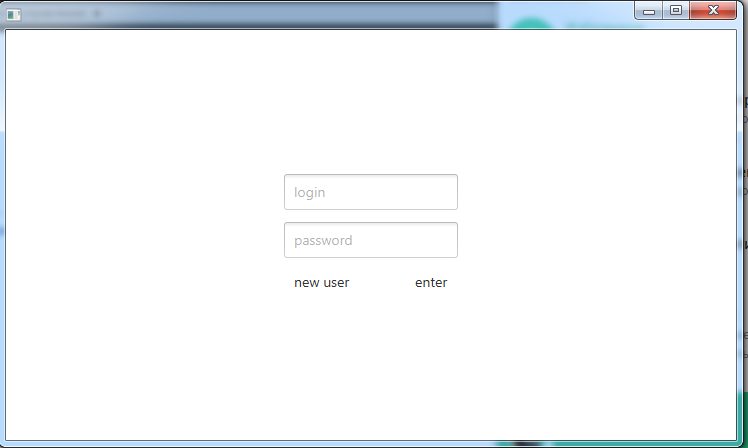
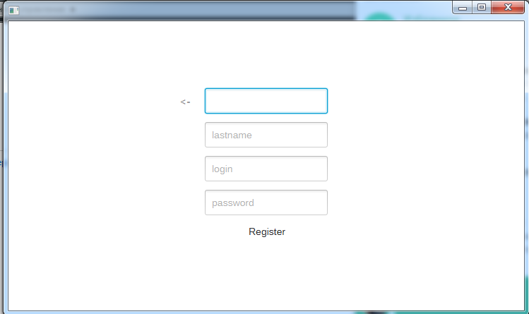
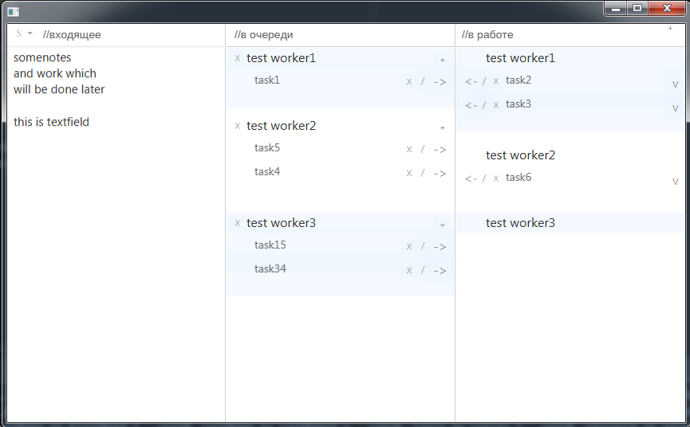

### Simple Task Manager
Desktop app created using JavaFX
It have login and user registration
uses Database to store all information
(by default it's local PostgreSQL, but can be changed to and other)

after loggin in there is three columns
first - it's a textfield for unnalocated tasks, notes, additional text and e.t.c.

second column it's queue column -> for work to be done by worker

third one is column of tasks that currently in work

you can add workers by + (plus) button it right top corner
on each worker there is another +(plus) button to add tasks for each worker
also near every task there is three buttons:
- / slash like button to edit task
- -> or <- it's a buttons to move task from "queue" column to "in work" (also it will change task type in database)
- and X to delete task

In text field you can select text and using right click create a new task from selected text, for convinience

Designed for Windows, for assembly you need to run insall in Maven, which will generate .exe in target folder.

### Менеджер задач 
Десктопное приложение, создано используя JavaFX библиотеку. 
При запуске есть окно логгирования и регистрации.
Данные хранятся в базе, по дефолту это PostgreSQL, но можно перенастроить на любую другую.

После логгирования есть три колонки

Первая - это текстовое поле (слева) для заметок, дополнительного текста, нераспределённых задач и т.д.

Вторая это колонка из задач в очереди (которые будут взяты в работу после завершения текущих задач в работе)

Третья это колонка для задач, которые сейчас находятся в работе у сотрудников

Сотрудников можно добавлять кнопкой + сверху справа.
На каждом сотруднике так же есть кнопка + для добавления задач для сотрудника
Так же на каждой задаче есть по три кнопки:
- / похожая на слеш кнопка для редактирования задачи;
- -> или <- это кнопки для перемещения задачи из колонки "в очереди" в колонку "в работе" (также это поменяет статус задачи в базе данных)
- X чтобы удалить задачу

Так же в текстовом поле можно выделить текст и сразу же создать задачу из выделенного, нажав правой кнопкой мыши и выбрав из нужного меню.

Рассчитана на Windows, для сборки запустить у Мавена инсталл, который сгенерит exe'шник в папку Таргет.
