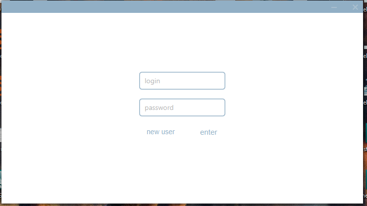
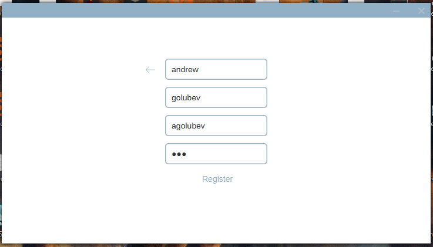
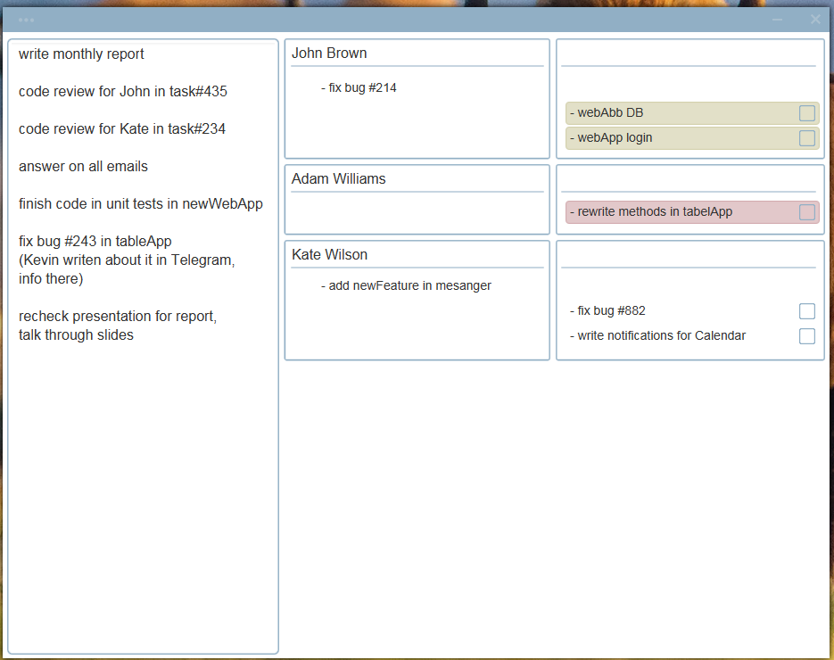
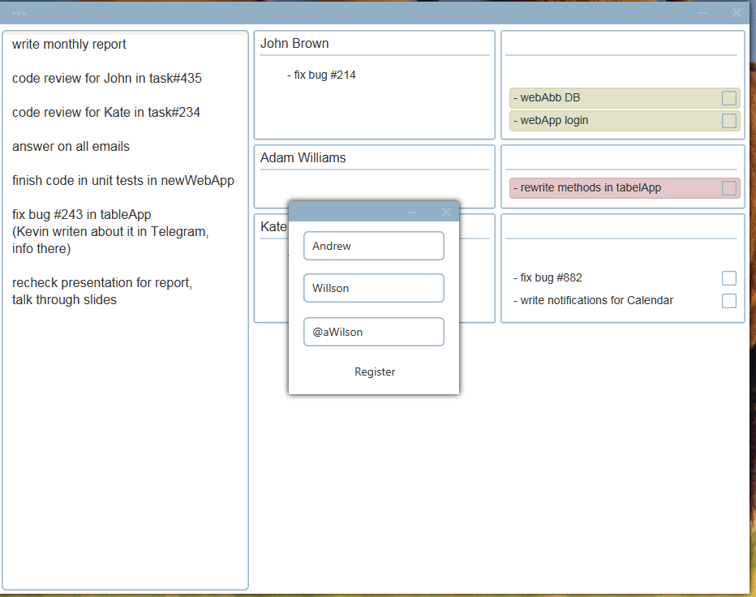
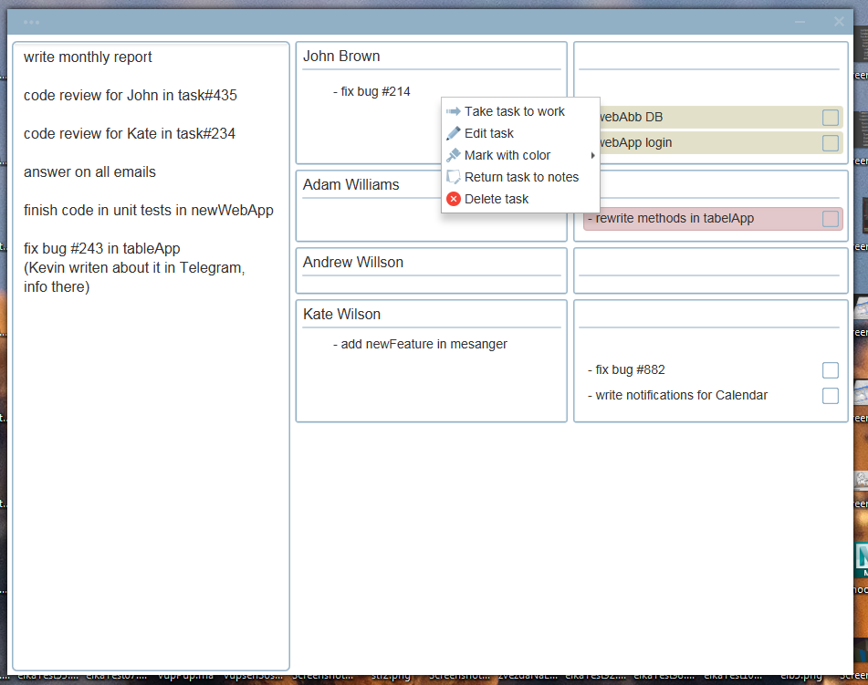
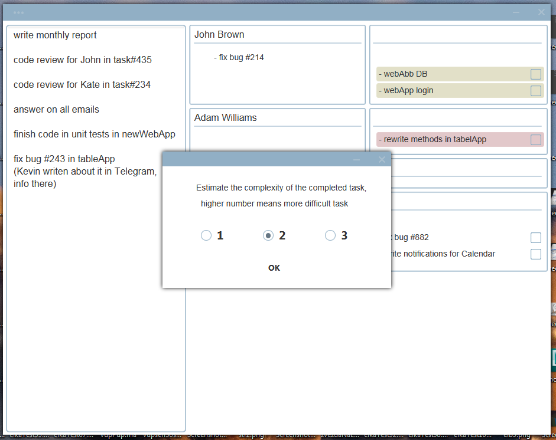
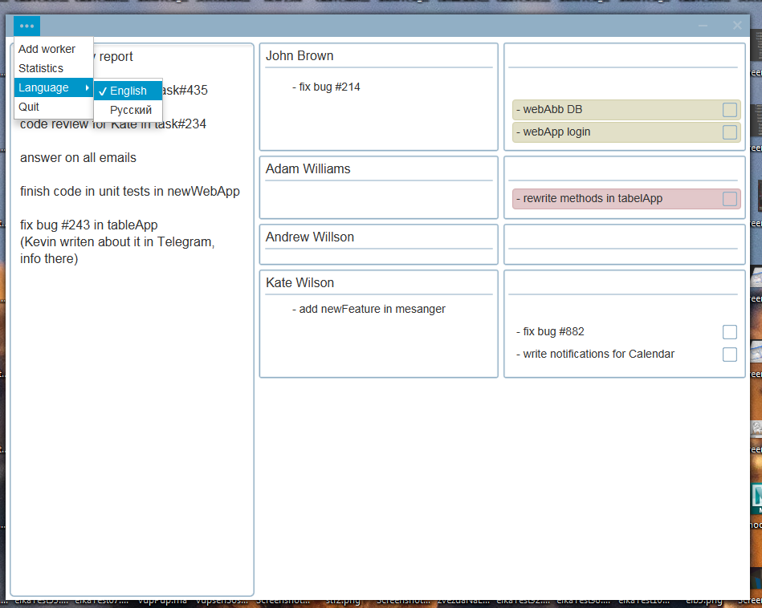
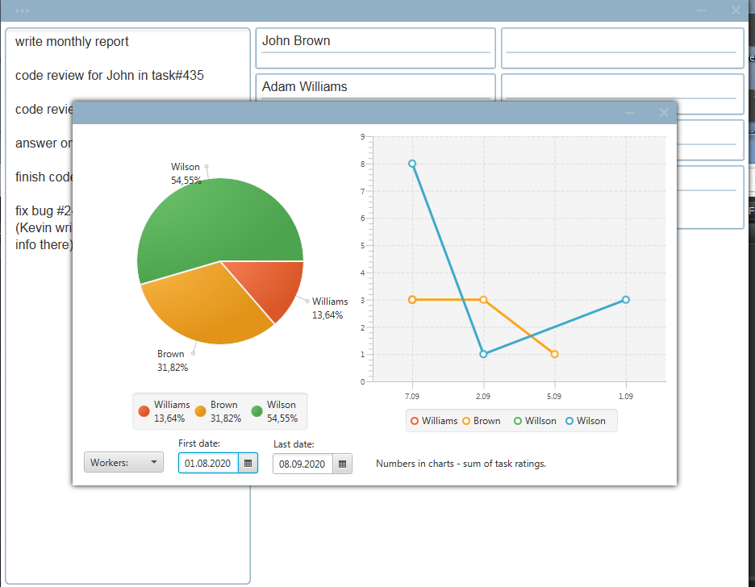
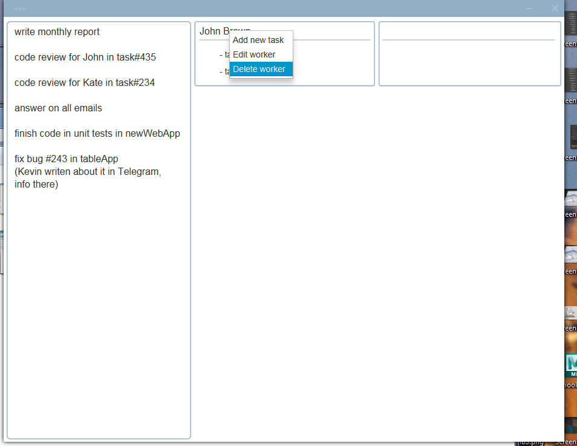
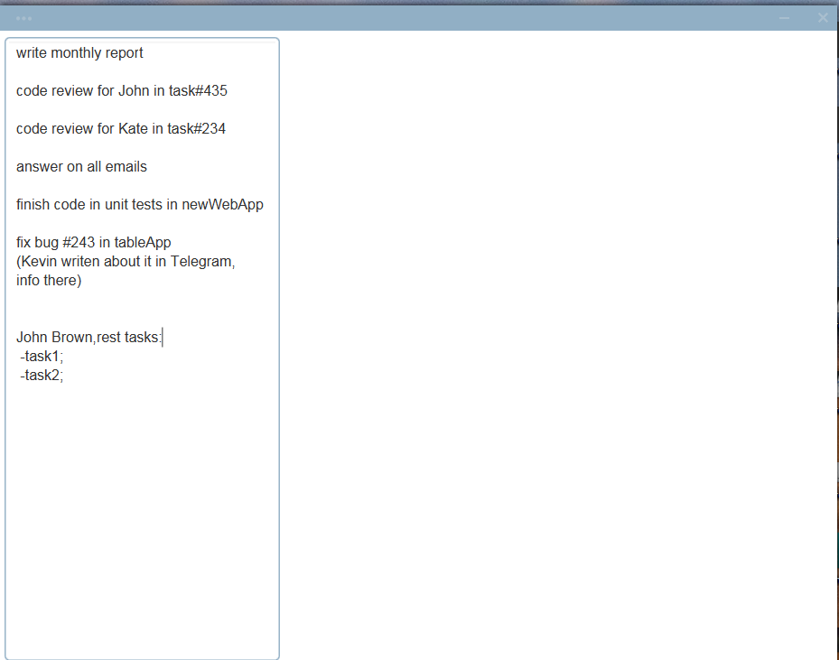

### Simple Task Manager (updated v2.0)
Desktop app created using JavaFX
It have login and user registration
uses Database to store all information
(by default it's local PostgreSQL, but can be changed to and other)

after loggin in there is three columns
first - it's a textfield for unnalocated tasks, notes, additional text and e.t.c.

second column it's queue column -> for work to be done by employee

third one is column of tasks that currently in work

you can add employees by pressing menu button in top left corner of window
there will be little popup window of employee registration

by rightclicking on task you can move task to work(or back in queue)
also threre is ability to mark it with color

by setting coursor on little square you can see it shows a jackdaw, if you will click on this,
little window will pop up, where you can set a task rating (difficulty) from 1 to 3, where 1 is a simple task and 3 is complex one
(this number is important, it used later in statistics window)

by clicking menu on top left corner you can change app language (currently only english and russian supported)

and there is statistics window with two charts, first one shows amount in percentage of each employee,
statistics count all rating from each employee and sums it, wich later used in pie chart to say which part of tasks was created by employee
second line chart shows rating-per-day, it sum's all rating tasks, created by employee during the day and uses this numbers for line chart data.
You can set selected employees, for example to compare one to another, or set up period of time to show in charts.

In text field you can select text and using right click create a new task from selected text, for convinience.
If you will need to delete worker, all tasks from him will be automatically added to textfield:

Designed for Windows, for assembly you need to run insall in Maven, which will generate .exe in target folder.
